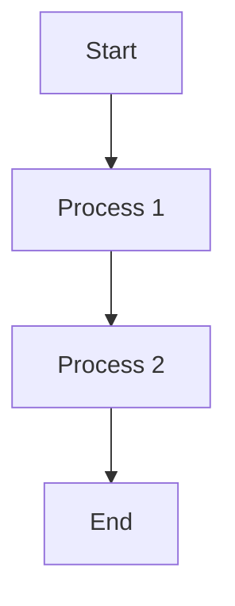
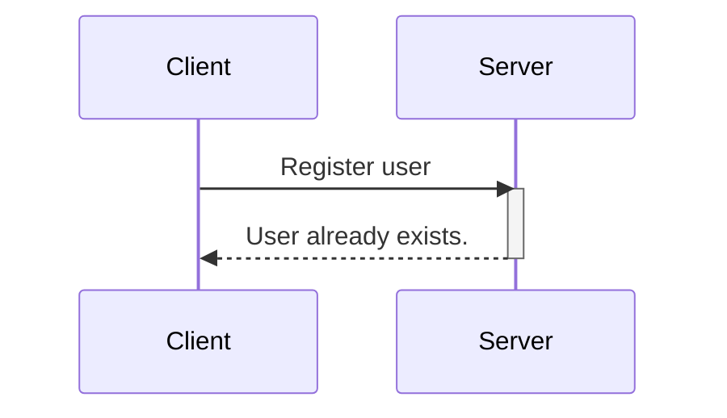
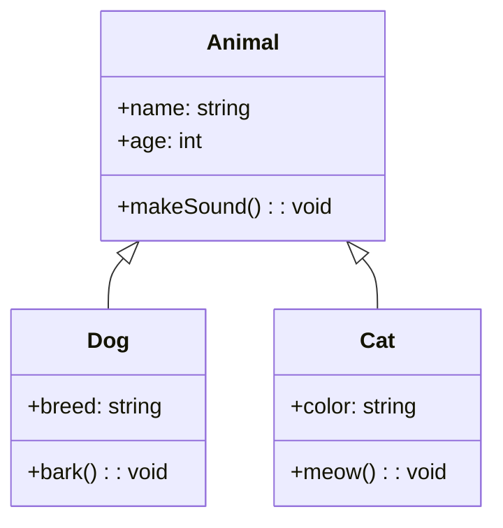
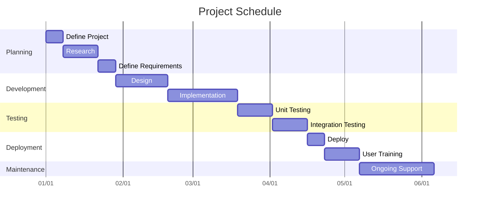

`These are the commands available to use`
`First off, install in VS the Auto-open preview markdown 

https://www.freecodecamp.org/news/markdown-cheat-sheet/`

TASK	MARKDWN SYNTAX

Heading 1	    #

Heading 2	    ##

Heading 3	    ###

Italics	        *italics*

Bold	        **Bold**

Strike	        ~~insert text~~

Block quote	    >

Links	        [link name](link.com)

Unordered list	* List item * List item

Code Block	    `insert code here`

With this you can create README.MD files....

# EXAMPLE README.MD

`these are real code blocks here!...`

## bla bla bla
* 1
* 2
* 3
 > bla bla bla

 **bla bla bla**

etc... [www.google.com] (www.google.com)
________________
________________
________________

https://www.freecodecamp.org/news/diagrams-as-code-with-mermaid-github-and-vs-code/

# Graphicals:

TYPE	DESCRIPTION

<|--	Inheritance

*--	    Composition

o--	    Aggregation

-->	    Association

--	    Link (Solid)

..>	    Dependency

..|>	Realization
..	Link (Dashed)

# EXAMPLE 1 

# Example 2
::: mermaid
graph TD;
    A-->B;
    A-->C;
    B-->D;
    C-->D;
:::

# Pie graph
::: mermaid
pie
    "whole" : 100
    "X" : 20
    "Y" : 75
    "rest" : 05
:::

# Flow chart

# Sequence driagram

# Class' diagram

# Gantt

